# Azure-Policy-and-ARM-Bicep-Labs
This repository documents my hands-on practice with **Azure Policies, ARM Templates, and Bicep**.   The goal of this lab was to enforce compliance with Azure Policies, deploy resources manually with ARM JSON templates, and create an automated deployment using Bicep.  

---

## 🔹 Lab Highlights  

### ✅ Azure Policy
- Created and assigned a policy that restricts resource creation to **specific regions**.  
- Applied this policy only to one resource group for testing purposes.  
- Verified policy effect by attempting deployments outside the allowed region.  

### ✅ ARM Template Deployment
When deploying a VM manually via ARM JSON template, I had to edit the following:  
1. Remove:  
   ```json
   "requiredGuestProvisionSignal": true
   
"adminPassword": "Pass-Code@2k25"

targetScope = 'subscription'

@description('Accepted location based on Azure Policies')
param region string = 'South Africa North'

resource BicepGroup 'Microsoft.Resources/resourceGroups@2025-04-01' = {
  name: 'BicepGroup'
  location: region
}

## Screenshots  

0. 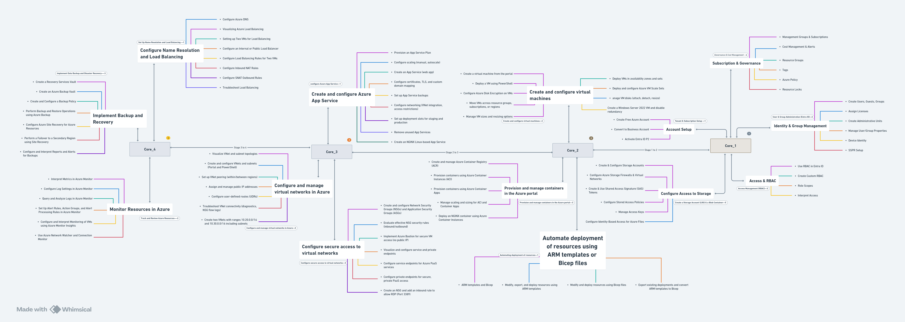  
1. 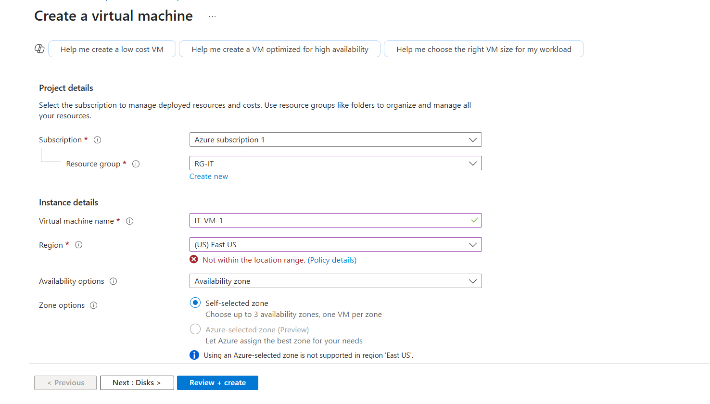  
2. 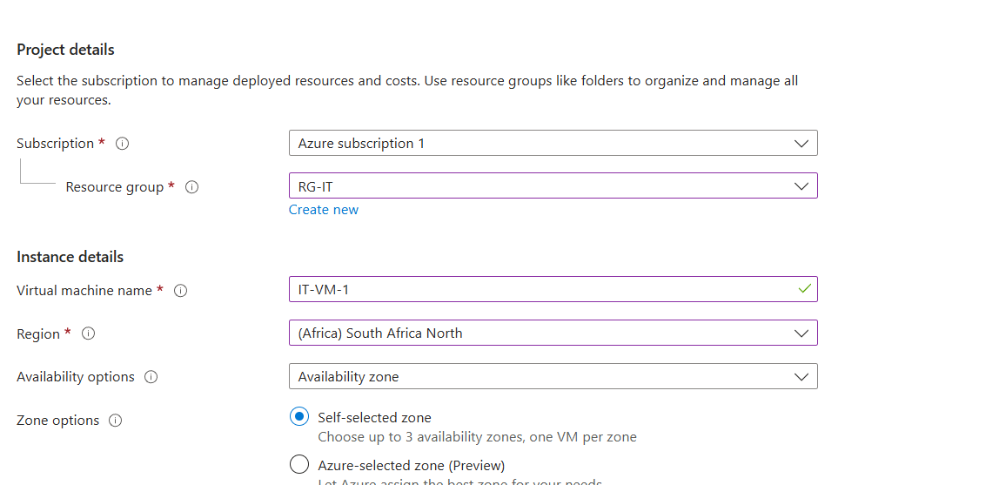  
3. 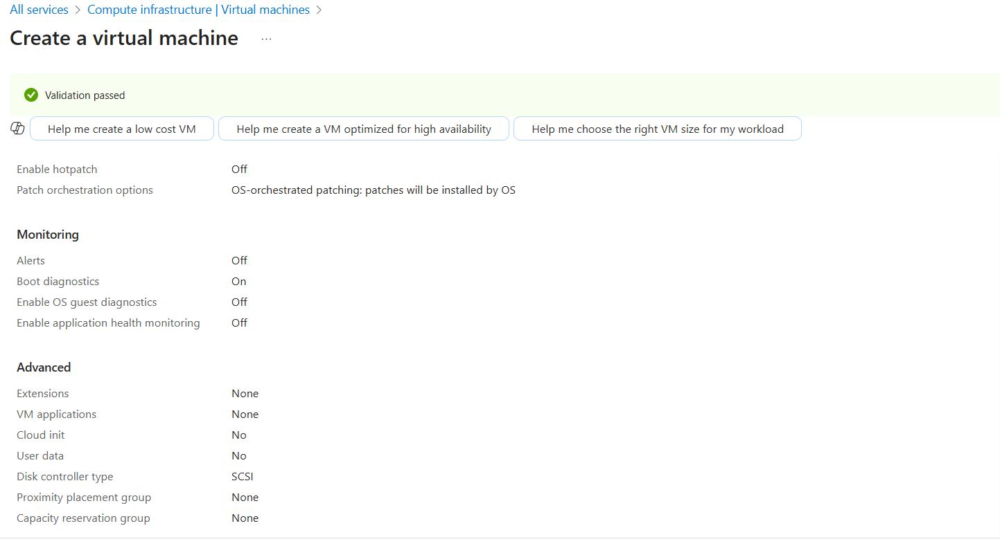  
4. 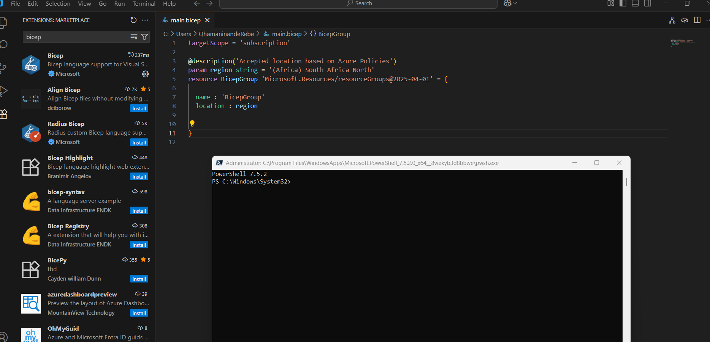  
5. 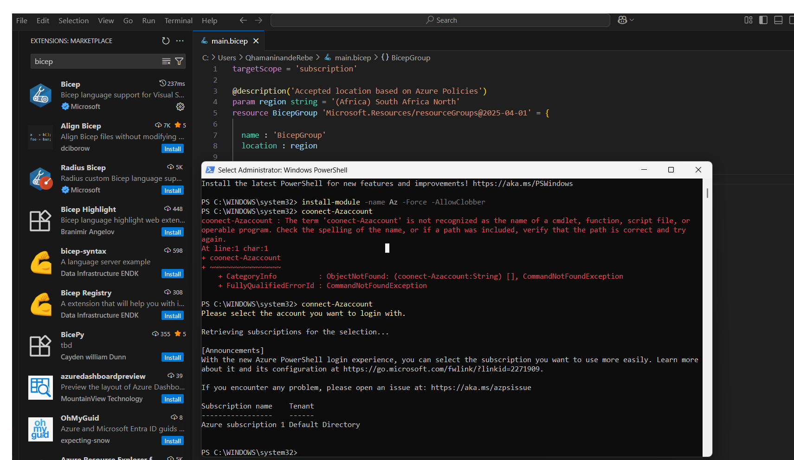  
6.   
7. 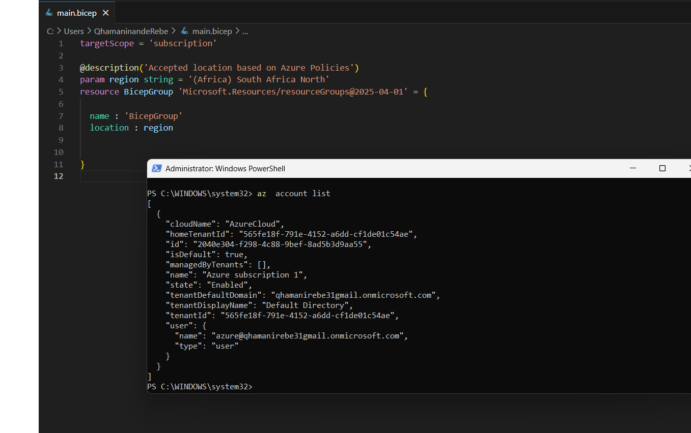  
8. 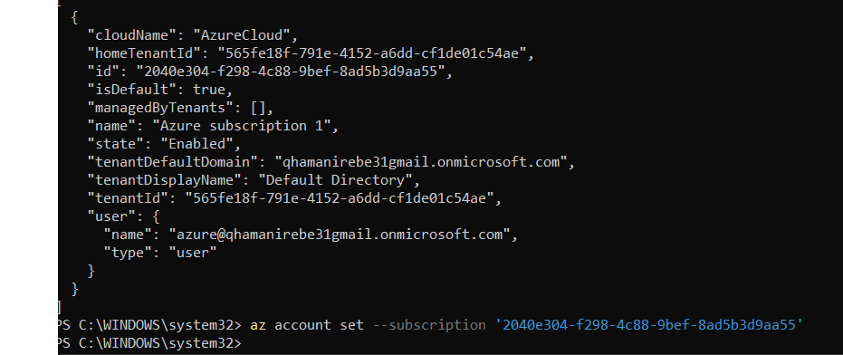  
9. 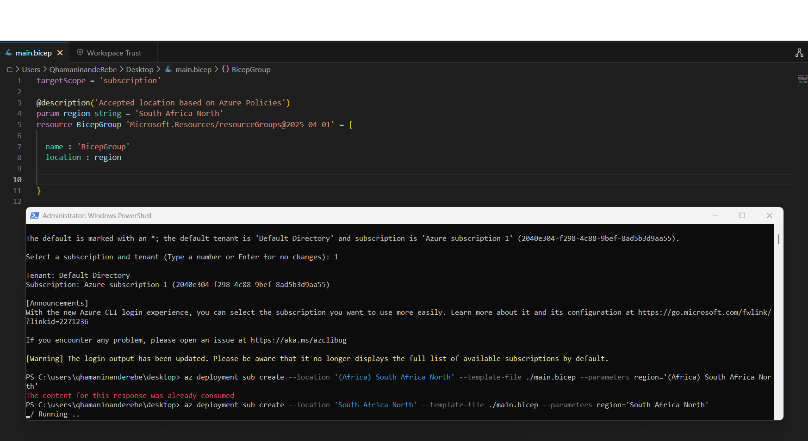  
10. 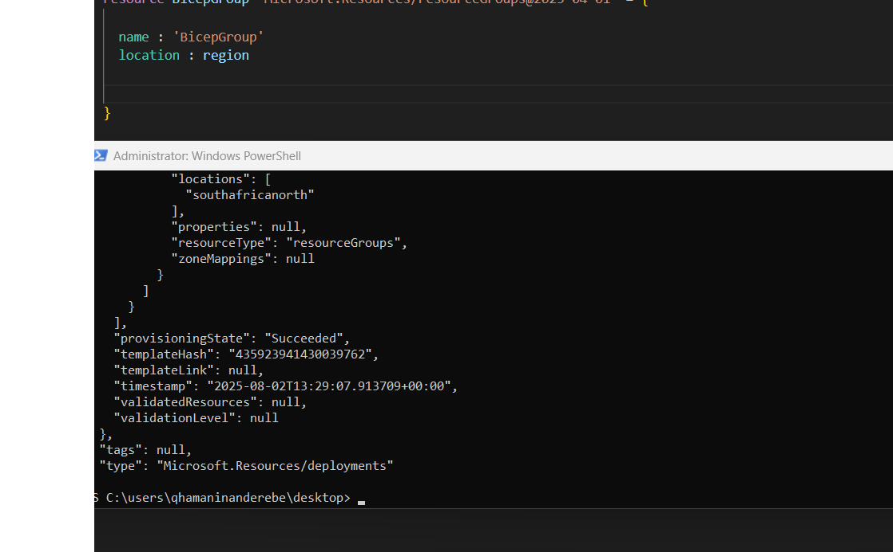  
11. 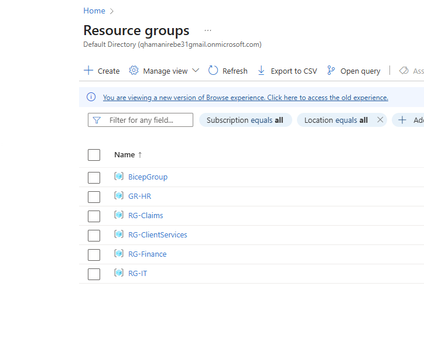  


📸 Screenshots

All screenshots (1–11) are available in the /images folder.
They capture policy creation, ARM JSON editing, and successful Bicep deployments.


